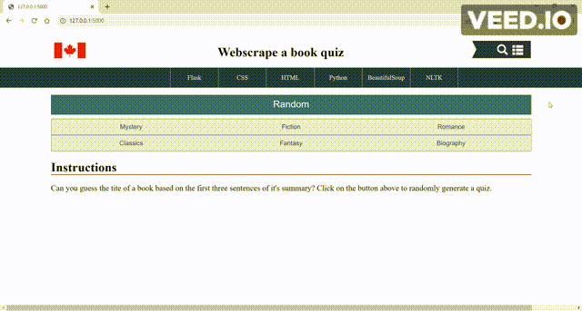
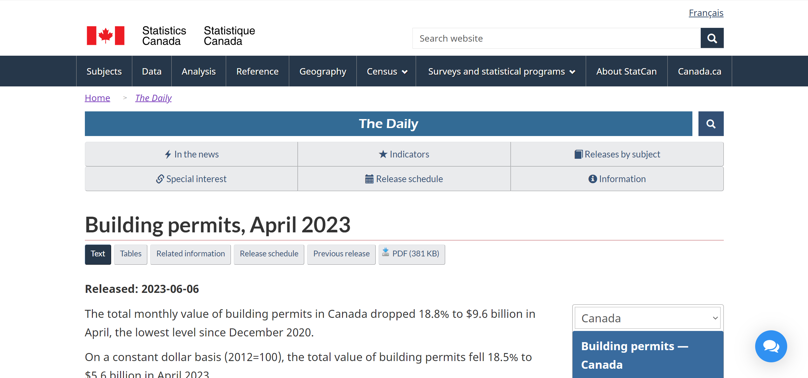

# Webscraped Quiz in Flask

A quiz app where users guess the tite of a book based on the first three sentences of it's summary.

### Components
- Webscaped [quiz contents](/https://books.toscrape.com/) using [Beautiful Soup](/https://www.crummy.com/software/BeautifulSoup/bs4/doc/)
- Website framework in [Flask](/https://flask.palletsprojects.com/en/2.3.x/) using HTML and CSS 
- Quiz using [WTForm](/https://wtforms.readthedocs.io/en/3.0.x/) 


## Installation

```bash
pip install -r requirements.txt
```

# Demo


## Style Guide

[Source](/https://www150.statcan.gc.ca/n1/daily-quotidien/230606/dq230606a-eng.htm)

# License
[MIT](https://choosealicense.com/licenses/mit/)

